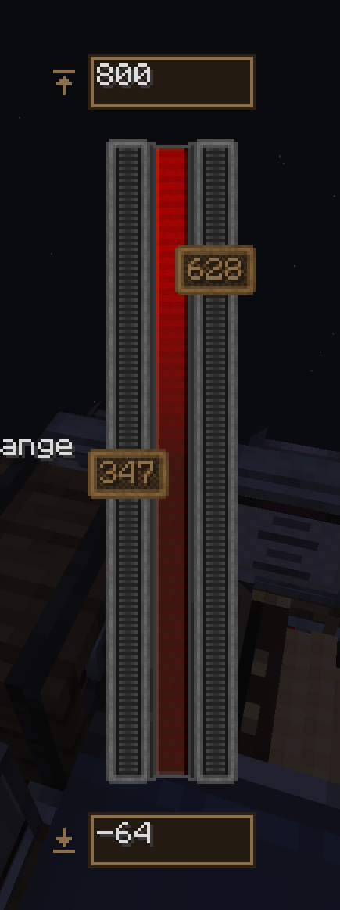

# Create Simulated: Altitude Unbound

Calibrate each Altitude Sensor from Create Simulated over an altitude range of your own, instead of
the world's build height.

NeoForge 1.21.1 · soft dependency on Create Simulated 1.3+

## Description

Simulated's Altitude Sensor turns height into redstone in two steps. First `toNormalHeight` maps the
sensor's world Y onto `0..1` between `minBuildHeight` and `maxBuildHeight`; then the two handles on
its screen pick a window inside that `0..1`, and that window is what spans redstone 0 to 15.

Step one is the ceiling. An aircraft cruising at Y 900 in a world that builds to 320 normalises to
`2.2` — well past the top of the scale, and no handle position can reach it, because both are
clamped to `0..1`. The same thing happens from the other side in a flat skyblock world, where the
entire flight envelope is squeezed into a sliver of the bar and the handles have no precision left.

This mod replaces the two ends of that mapping with altitudes you type on the sensor's own screen.
Everything downstream is untouched — the handles, the redstone output, the dial, the display source,
the ComputerCraft peripheral. They simply work against a scale that reaches as high as the aircraft
does.

A sensor you never calibrate behaves exactly as it did before, and writes exactly the NBT it did
before.

### Using it

Right-click a sensor. A box sits above the gauge for the top of the scale and another below it for
the bottom.

- Leave a box **blank** and that end follows the world's build limit, which is the untouched
  behaviour. The grey hint inside the box is that limit, so you can see what blank means — and it
  stays visible while you type.
- Type an altitude and the gauge re-scales as you go: the numbers beside the two handles are read
  back through the sensor, so they follow immediately. Nothing to confirm; the values reach the
  server when the screen closes, alongside Simulated's own.
- Changing the scale leaves each handle at the altitude it was already set to. Stretch the scale
  upwards and a handle stays put; shrink it past a handle and that handle is pushed to the new end —
  and no further, so it returns to where it was if the scale grows back.
- The text turns red if the range is upside down or too narrow, and the gauge keeps the last good
  scale rather than going haywire mid-keystroke.
- Either end may reach past the world's build limits. That is the point.

The **wheel** drives the handles: hover a handle, its rail, or the lit bar between the two, and
scroll. One notch is one redstone level; **shift** for a fine step, **ctrl** to slide both handles
together without resizing the window. Over the middle of the bar, the nearer handle takes the
scroll.

Each sensor carries its own range, so a cruise sensor and an approach sensor can be calibrated
differently on the same aircraft. Engineers' Goggles report the scale in force and whether it is
custom, under the height and air pressure Simulated already shows. A Clipboard copies the
calibration along with the handle positions.

### How it works

Simulated exposes no extension point here, so this is four small mixins:

| Class | What it does |
| --- | --- |
| `AltitudeSensorBlockEntityMixin` | Holds the range, rewrites `toNormalHeight` / `toWorldHeight`, persists to NBT, extends the goggle tooltip and the Clipboard payload |
| `AltitudeSensorScreenMixin` | Adds the two framed inputs around the gauge, drives the handles with the wheel, re-centres each handle on a change of scale, and shrinks a handle's label when it outgrows the handle |
| `AltitudeSensorMovementBehaviourMixin` | Applies the same range to the dial on a moving Create contraption, which renders without the block entity |
| `AltitudeUnboundMixinPlugin` | Skips all of the above when Simulated is not installed |

The range lives in the block entity's NBT, which Simulated already writes on both the save path and
the client packet — so persistence and client sync come for free. The only packet this mod defines
is the client asking the server to apply a new range; a sensor riding a Simulated structure lives in
a sub-level plot, so that request checks reach against the sensor's projected world position rather
than its raw block coordinates.

## Screenshot



## Build

```
./gradlew build
```

The jar lands in `build/libs/`. Dependencies are all `compileOnly` and resolve from the Maven
repositories declared in `build.gradle`; none of them ships inside the jar.

To run the mod in a development client:

```
./gradlew runClient
```

That expects Create, Create Aeronautics and Sable in `run/mods/`. Nothing else is needed — the mod
declares `simulated` and `create` as optional dependencies, and its mixin config refuses to apply
when Simulated is absent, so the jar is inert rather than broken in a pack without it.
